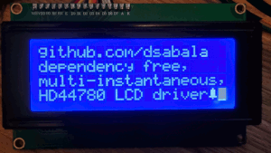

# Dependency free HD44780 driver



[](http://github.com/dsabala/hd44780/issues)
[](https://github.com/dsabala/hd44780/releases)
[](https://raw.githubusercontent.com/dsabala/hd44780/master/LICENSE)

Yet another HD44780 C driver. It might fit your needs if you are interested in one of its core features:
- [dependency free](#dependency-free) (its free even from standard library)
- [multi-instantaneous](#multi-instantaneous), so more than one LCDs can be driven
- [delays reduced to the minimum](#minimal-delays)
- one source file and one header file
- CMake support
- MIT license

### Dependency free
First ten to twenty github HD44780 libraries I found were tightly coupled to one of the most popular embedded platforms like Arduino or STM32. If you believe the virtue of the library is not to force the user to modify it, then this library is for you. It even does not need standard library.

### Multi-instantaneous
Runtime dependency injection is realised using "virtual pointers" to callback functions, that library user have to implement. Thanks to this
solution, multiple instances of LCDs can be managed.

### Minimal delays
Efforts were made to eliminate unnecessary delays:
- busy flag is checked before writing instruction / data and no blocking delay is performed after that
- delaying init after power up (for 15ms) is your responsibility.

## Status
Library was tested only on one 4x20 LCD and part of the HD44780 functions were not implemented (shifting display) and at least on function - changing position will not work on other displays with different column count, but the most simple one - like changing DDRAM address should work on every machine. I would be very grateful if you decide to help develop the library, so pull requests are welcome.

## Usage
Implement callback functions hiding all platform dependecies like HAL drivers. Example for STM32F407 Discovery board (see also example folder).

```c
hd44780_hdl * hd44780_get_handle(void) {
  static hd44780_hdl config =
  {.cb_config_gpio = hd44780_cb_config_gpio,
   .cb_delay_ms = hd44780_cb_delay_ms,
   .cb_ctrl_pin = hd44780_cb_ctrl_pin,
   .cb_read_bus = hd44780_cb_read_bus,
   .cb_write_bus = hd44780_cb_write_bus,
   .cursor_config = CURSOR_OFF,
   .interface = INTERFACE_4BIT };

  return &config;
}

void hd44780_cb_config_gpio(hd44780_gpio_dir_t const direction) {
  /* Pins E, RW, RS are allways output */
  GPIO_InitTypeDef gpio;
  gpio.Mode = GPIO_MODE_OUTPUT_PP;
  gpio.Pull = GPIO_NOPULL;
  gpio.Speed = GPIO_SPEED_FREQ_LOW;
  gpio.Pin = GPIO_PIN_9;
  HAL_GPIO_Init(GPIOC, &gpio);
  gpio.Pin = GPIO_PIN_10;
  HAL_GPIO_Init(GPIOC, &gpio);
  gpio.Pin = GPIO_PIN_10;
  HAL_GPIO_Init(GPIOA, &gpio);

  /* Data bus pins direction are input/output depending on data direction */
  if (direction == GPIO_DIR_IN) {
    gpio.Mode = GPIO_MODE_INPUT;
    gpio.Pull = GPIO_NOPULL;
    gpio.Speed = GPIO_SPEED_FREQ_LOW;
    gpio.Pin = GPIO_PIN_11;
    HAL_GPIO_Init(GPIOC, &gpio);
    gpio.Pin = GPIO_PIN_15;
    HAL_GPIO_Init(GPIOA, &gpio);
    gpio.Pin = GPIO_PIN_7;
    HAL_GPIO_Init(GPIOB, &gpio);
    gpio.Pin = GPIO_PIN_5;
    HAL_GPIO_Init(GPIOB, &gpio);
    gpio.Pin = GPIO_PIN_0;
    HAL_GPIO_Init(GPIOD, &gpio);
    gpio.Pin = GPIO_PIN_2;
    HAL_GPIO_Init(GPIOD, &gpio);
    gpio.Pin = GPIO_PIN_4;
    HAL_GPIO_Init(GPIOD, &gpio);
    gpio.Pin = GPIO_PIN_6;
    HAL_GPIO_Init(GPIOD, &gpio);
  } else {
    gpio.Mode = GPIO_MODE_OUTPUT_PP;
    gpio.Pull = GPIO_NOPULL;
    gpio.Speed = GPIO_SPEED_FREQ_LOW;
    gpio.Pin = GPIO_PIN_11;
    HAL_GPIO_Init(GPIOC, &gpio);
    gpio.Pin = GPIO_PIN_15;
    HAL_GPIO_Init(GPIOA, &gpio);
    gpio.Pin = GPIO_PIN_7;
    HAL_GPIO_Init(GPIOB, &gpio);
    gpio.Pin = GPIO_PIN_5;
    HAL_GPIO_Init(GPIOB, &gpio);
    gpio.Pin = GPIO_PIN_0;
    HAL_GPIO_Init(GPIOD, &gpio);
    gpio.Pin = GPIO_PIN_2;
    HAL_GPIO_Init(GPIOD, &gpio);
    gpio.Pin = GPIO_PIN_4;
    HAL_GPIO_Init(GPIOD, &gpio);
    gpio.Pin = GPIO_PIN_6;
    HAL_GPIO_Init(GPIOD, &gpio);
  }
}

void hd44780_cb_delay_ms(uint8_t const time_ms) { HAL_Delay(time_ms); }

void hd44780_cb_ctrl_pin(hd44780_ctrl_pin_t const pin, hd44780_pin_state_t const state) {
  GPIO_PinState const pin_state = (state == PIN_SET) ? GPIO_PIN_SET : GPIO_PIN_RESET;
  switch (pin) {
    case HD44780_PIN_RS:
      HAL_GPIO_WritePin(GPIOC, GPIO_PIN_9, pin_state);
      break;
    case HD44780_PIN_RW:
      HAL_GPIO_WritePin(GPIOC, GPIO_PIN_10, pin_state);
      break;
    case HD44780_PIN_E:
      HAL_GPIO_WritePin(GPIOA, GPIO_PIN_10, pin_state);
      break;
    default:
      break;
  }
}

uint8_t hd44780_cb_read_bus(void) {
  uint8_t data = 0;
  data |= (HAL_GPIO_ReadPin(GPIOA, GPIO_PIN_15) == GPIO_PIN_RESET) ? 0x00U : (0x01U << 0U);
  data |= (HAL_GPIO_ReadPin(GPIOC, GPIO_PIN_11) == GPIO_PIN_RESET) ? 0x00U : (0x01U << 1U);
  data |= (HAL_GPIO_ReadPin(GPIOD, GPIO_PIN_0) == GPIO_PIN_RESET) ? 0x00U : (0x01U << 2U);
  data |= (HAL_GPIO_ReadPin(GPIOD, GPIO_PIN_2) == GPIO_PIN_RESET) ? 0x00U : (0x01U << 3U);
  data |= (HAL_GPIO_ReadPin(GPIOD, GPIO_PIN_4) == GPIO_PIN_RESET) ? 0x00U : (0x01U << 4U);
  data |= (HAL_GPIO_ReadPin(GPIOD, GPIO_PIN_6) == GPIO_PIN_RESET) ? 0x00U : (0x01U << 5U);
  data |= (HAL_GPIO_ReadPin(GPIOB, GPIO_PIN_7) == GPIO_PIN_RESET) ? 0x00U : (0x01U << 6U);
  data |= (HAL_GPIO_ReadPin(GPIOB, GPIO_PIN_5) == GPIO_PIN_RESET) ? 0x00U : (0x01U << 7U);
  return data;
}

void hd44780_cb_write_bus(uint8_t const data) {
  HAL_GPIO_WritePin(GPIOA, GPIO_PIN_15, (data & (1U << 0U)) ? GPIO_PIN_SET : GPIO_PIN_RESET);
  HAL_GPIO_WritePin(GPIOC, GPIO_PIN_11, (data & (1U << 1U)) ? GPIO_PIN_SET : GPIO_PIN_RESET);
  HAL_GPIO_WritePin(GPIOD, GPIO_PIN_0, (data & (1U << 2U)) ? GPIO_PIN_SET : GPIO_PIN_RESET);
  HAL_GPIO_WritePin(GPIOD, GPIO_PIN_2, (data & (1U << 3U)) ? GPIO_PIN_SET : GPIO_PIN_RESET);
  HAL_GPIO_WritePin(GPIOD, GPIO_PIN_4, (data & (1U << 4U)) ? GPIO_PIN_SET : GPIO_PIN_RESET);
  HAL_GPIO_WritePin(GPIOD, GPIO_PIN_6, (data & (1U << 5U)) ? GPIO_PIN_SET : GPIO_PIN_RESET);
  HAL_GPIO_WritePin(GPIOB, GPIO_PIN_7, (data & (1U << 6U)) ? GPIO_PIN_SET : GPIO_PIN_RESET);
  HAL_GPIO_WritePin(GPIOB, GPIO_PIN_5, (data & (1U << 7U)) ? GPIO_PIN_SET : GPIO_PIN_RESET);
}
```

Call functions passing pointer to configuration

```c
  /* Remember to wait 15ms after power up */
  HAL_Delay(15);

  hd44780_hdl * hd44780_cfg = hd44780_get_handle();

  hd44780_init(hd44780_cfg);

  static uint8_t const alarm_icon_index = 0U;
  static uint8_t const alarm_icon[8] = {0x04, 0x0E, 0x0E, 0x0E, 0x0E, 0x1F, 0x04, 0x00};
  hd44780_def_char(hd44780_cfg, alarm_icon_index, alarm_icon);

  hd44780_clear(hd44780_cfg);
  hd44780_goto(hd44780_cfg, 0, 0);
  hd44780_write_text(hd44780_cfg, "github.com/dsabala");

  hd44780_goto(hd44780_cfg, 1, 0);
  hd44780_write_text(hd44780_cfg, "dependency free,");

  hd44780_goto(hd44780_cfg, 2, 0);
  hd44780_write_text(hd44780_cfg, "multi-instantaneous,");

  hd44780_goto(hd44780_cfg, 3, 0);
  hd44780_write_text(hd44780_cfg, "HD44780 LCD driver");

  hd44780_disp_char(hd44780_cfg, alarm_icon_index);

  HAL_Delay(2000);

  hd44780_cfg->cursor_config = CURSOR_BLINK;
  hd44780_cursor_cfg(hd44780_cfg);
```
